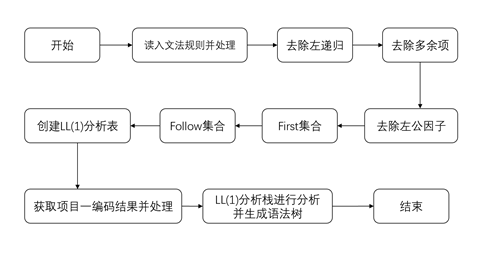
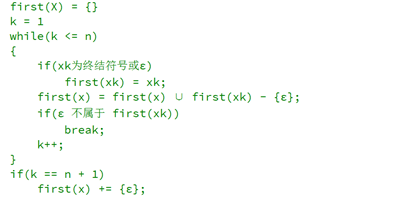
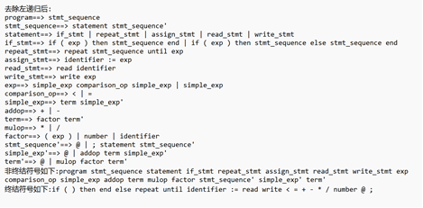

# LL(1)语法分析

## 项目内容
(1)以文本文件的方式输入某一高级程序设计语言的所有语法对应的BNF文法，因此系统需要提供一个操作界面，让用户打开某一语言的所有语法对应的BNF文法的文本文件，该文本文件的具体格式可根据自己实际的需要进行定义。  
(2)需要提供窗口以便用户可以查看文法化简后的结果(可用表格形式进行呈现)  
(3)需要提供窗口以便用户可以查看消除左公共因子和左递归之后的新文法(可用表格形式进行呈现)  
(4)求出改造后文法的每个非终结符号的 First 集合和 Follow 集合，并需要提供窗口以便用户可以查看该结果(可用两张表格的形式分别进行呈现)  
(5)构造出 LL(1)分析表，并需要提供窗口以便用户可以查看该结果(可用表格形式进行呈现)  
(6)采用LL(1)语法分析方法进行语法分析并生成相应的语法树，每个语句的语法树结构可根据实际的需要进行定义。(语法树需要采用树状形式进行呈现)  
(7)对系统进行测试:以TINY 语言的所有语法以及第一项任务的测试结果sample.lex 作为测试，进行LL(1)语法分析并生成对应的语法树。  

## 实现思路
项目二包含mainwindow.h，mainwindow.cpp，processor.h，processor.cpp，linknode.h，main.cpp，mainwindow.ui七个文件。Mainwindow头文件包含MainWindow类（QT界面）中成员函数的声明、ui界面的声明；Mainwindow源文件包含对于c++源程序在QT界面中操作的具体实现函数；linknode头文件包含文法规则的存储结构、linknode类中成员函数的声明和实现；processor头文件包含processor类以及成员函数的声明，成员函数实现文法规则的化简、去除左递归、去除左公因子、得到first集合、得到follow集合、生成LL(1)分析表、生成语法树；processor源文件包含对于文法问题具体操作函数的实现；main函数用于显示菜单、接受用户指令并调用相应函数来进行各项操作。

#### linknode类
linknode头文件包含文法规则的存储结构、linknode类中成员函数的声明和实现包括初始化文法规则、添加文法规则、判断是否有epsilon存在等函数功能。

#### processor类
processor头文件包含processor类中文法结构、first集合和follow集合的存储结构、终结符号和非终结符号的存储以及成员函数的声明，成员函数实现文法规则的化简、去除左递归、去除左公因子、得到first集合、得到follow集合以及线性规则生成的DFA图。processor源文件包含对于文法问题具体操作函数的实现。

## 数据结构

#### 文法规则存储
左部  | 右部  | 文法规则
---- | ----- | ------ 
S |	[A,B,C],[D]  |	S->ABC|D
A |	[a,B],[@] |	A->aB|@
B |	[c,C],[@] |	B->cC|@
C |	[e,C],[@] |	C->eC|@
D |	[i],[j]  |	D->i|j

#### First集合/Follow集合存储结构
非终结符号 |	FOLLOW集合存储 |	FOLLOW集合
---- | ----- | ------ 
S |	{$} |	Follow(S)={$}
A |	{e} |	Follow(A)={e}
B |	{$,a} |	Follow(B)={$,a}
C |	{b} |	Follow(C)={b}

#### 其他数据
字段名称 |	数据类型 |	说明
---- | ----- | ------ 
left|	string|	文法规则左部
right|	vector<vector<string>>|	文法规则右部
grammers|	vector<LinkNode>|	文法规则
startnode|	string|	开始结点
visited|	bool|	判断是否访问过
finalword|	vector<string>|	终结符号
nonfinalword|	vector<string>|	非终结符号
first|	map<string, set<string>>|	First集合
follow|	map<string, set<string>>|	Follow集合
match|	map<string,set<string>>|	终结符对应文法规则
table|	vector<vector<string>>|	LL(1)分析表
code|	map<string,string>|	读入编码结果
Str	|vector<string>|	存储进栈的字符串
analyzeStack|	stack<string>|	分析栈
Stree|	stack<string>|	语法树栈

## 功能结构

## 核心模块设计与实现

#### 建立文法规则
主要思路：从文件中读取文法规则，将每条文法规则存入vector<LinkNode> grammers。首先判断文法规则格式是否正确，如果找不到“->”则文法格式不正确，对于有害规则如S->S直接删除不存入。然后将第一个字符存入左部left中，根据“|”来分割右部字符串并将分割后的字符串存入右部中。最后生成终结符号和非终结符号，左部一定是非终结符号，对于右部设置标志被记录过设置为1，未记录设置为0，将未被记录的右部字符存入终结符号finalword中。

#### 去除左递归
主要思路：首先对文法规则进行遍历，将右部的非终结符号用对应的文法规则替代，对于每一条文法规则进行迭代，如果右部中的字符与其他文法规则的左部相同，则取出另一文法规则的右部加入该文法规则中，并存储原右部中含有该字符的数组内容去除该字符，与右部合并。如S->As|s，A->Sa|a，就将S带入A中，将间接左递归转化成直接左递归，然后消除直接左递归，使用新建结点如“A’”并加入原文法规则的右部末尾，新建的左部存入对应的文法规则。如A -> Aa|b，就转换成A -> bA’，A’-> aA’ |@，最后更新文法的终结符号和非终结符号。总之先将间接左递归转化为直接左递归，再进行直接左递归的消除。

#### 去除多余项
主要思路：有害规则在存入文法时直接删除不存入，对于多余规则指文法中任何推导都不会用到的规则，那么则对文法规则进行深度遍历即如果该字符是非终结字符则遍历该字符对应的文法规则并用记号标记，遍历过则记为true，遍历后将未被遍历的文法规则删除。

#### 去除左公因子
主要思路：使产生式右部没有公共因子，若产生式右部有左公因子，则反复提取，直到引进的新非终结符的有关的产生式再无左公共因子为止。执行一次提取一个左公因子，对于某条文法规则，若有左公因子，就返回处理好后的文法规则，若没有左公因子，就返回一个空的vector，执行多次就能提取所有的左公因子。如S->Aab|Aa，第一次提取之后为S->AS’，S’->ab|a，第二次提取之后是S’->aS’’,S’’->b|@。

#### first集合

#### follow集合

#### 建立LL(1)分析表
主要思路：首先初始化分析表将遍历vector将终结符和非终结符加入分析表，分析表的行数等于非终结符数量加一，列数等于终结符数量加一。然后遍历first集合，如果终结符a属于first(A)，把A->X1X2…Xn加入到M[A,a]中，创建first集合时将a对应的文法规则存储在map中；若@属于first(A)则对于follow(A)中的每个符号a，将A->@加入M[A,a]。

#### 进行LL(1)语法分析并建立语法树
主要思路：首先将项目一的编码结果预处理读入map中，将分析的字符串存入vector中。然后建立分析栈与语法树栈，将开始符号加入分析栈并建立根节点，逐个读入vector中的字符串，在分析表中寻找，找到对应的文法规则逆序压入分析栈中；找到结果为@则pop出分析栈；如果找到结果为没有对应的文法规则就return；找到结果与字符串相等，则对于字符串分类，如果编码为1是关键字，新建节点，if建立三个子节点分别存储条件、then、else；repeat建立两个子节点存储语句、until；do建立两个子节点存储语句、while；其他关键字建立一个子节点。如果编码为2是操作符，新建节点，建立两个子节点。如果编码是4或者5是id或者number则压入语法树栈。如果编码是3是分隔符，则将语法树栈中的字符pop出并新建节点。循环至分析栈为空。

## 测试结果
文法规则读取并处理：  
  
去除左递归：  
   
去除多余项：  
  
去除左公因子：  
   
处理后文法：   
  
生成first集合和follow集合  
  
LL(1)分析表：  
  
语法树：  
  
