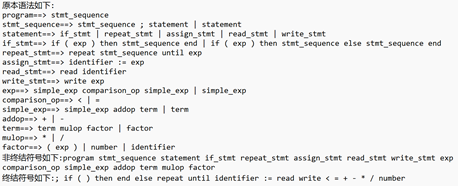

# 词法分析

## 项目内容
(1)以文本文件的方式输入某一高级程序设计语言的所有单词对应的正则表达式，系统需要提供一个操作界面，让用户打开某一语言的所有单词对应正则表达式文本文件，该文本文件的具体格式可根据自己实际的需要进行定义。  
(2)需要提供窗口以便用户可以查看转换得到的NFA(可用状态转换表呈现)  
(3)需要提供窗口以便用户可以查看转换得到的DFA(可用状态转换表呈现)  
(4)需要提供窗口以便用户可以查看转换得到的最小化DFA(可用状态转换表呈现)  
(5)需要提供窗口以便用户可以查看转换得到的词法分析程序(该分析程序需要用C语言描述)  
(6)对要求(5)得到的源程序进行编译生成一个可执行程序，并以该高级程序设计语言的一个源程序进行测试，输出该源程序的单词编码。需要提供窗口以便用户可以查看该单词编码。  
(7)对系统进行测试:  
      (a)先以TINY语言的所有单词的正则表达式作为文本来测试，生成一个TINY语言的词法分析源程序;    
      (b)接着对这个词法分析源程序利用C/C++编译器进行编译，并生成可执行程序;    
      (c)以sample.tny来测试，输出该 TINY 语言源程序的单词编码文件sample.lex。    

## 实现思路
  项目包含mainwindow.h，mainwindow.cpp，graph.h，graph.cpp，nfadfa.h，nfadfa.cpp，main.cpp，mainwindow.ui八个文件。Mainwindow头文件包含MainWindow类（QT界面）中成员函数的声明、ui界面的声明；Mainwindow源文件包含对于c++源程序在QT界面中操作的具体实现函数；graph头文件包含Edge结构体、Vertex结构体、graph类中成员函数的声明；graph源文件包含对于邻接表具体操作函数的实现；nafdaf头文件包含nfadfa类以及成员函数的声明，成员函数实现正则表达式、NFA、DFA、最小化DFA的转换；nfadfa源文件包含nfadfa类成员函数的具体实现；main函数用于显示菜单、接受用户指令并调用相应函数来进行各项操作。

#### Mainwindow类
Mainwindow头文件包含MainWindow类（QT界面）中成员函数的声明、ui界面的声明；Mainwindow源文件包含对于c++源程序在QT界面中操作的具体实现函数。函数功能有打开文件、保存文件、正则表达式转换NFA、NFA展示、DFA展示、最小化DFA展示、生成词法分析程序分别对应功能选择button。

#### Edge结构体
Edge结构体包含邻接表中边的信息如边的权值（dest）、下一节点（link）、下一顶点序号（nextvertex）等。

#### Vertex结构体
Vertex结构体包含邻接表中顶点的信息如顶点序号（data）、邻接表头结点（adj）、判断是否是最后一个节点（end）等。

#### Graph类
graph头文件包含Edge结构体、Vertex结构体、graph类中成员函数的声明；graph源文件包含对于邻接表具体实现操作函数的实现，邻接表的建立：点的插入insertVertex函数、边的插入insertEdge函数、获取结点的序号getvertexpos函数、获取边的权值getvalue函数，邻接表的深度遍历DFS函数等。

#### Nfadfa类
nafdaf头文件包含nfadfa类以及成员函数的声明，成员函数实现正则表达式、NFA、DFA、最小化DFA的转换；nfadfa源文件包含nfadfa类成员函数的具体实现，对于正则表达式的处理。

## 数据结构
采用邻接表构建有向图进行数据的存储和组织。

数据安排如下：

字段名称 |	数据类型 |	说明
---- | ----- | ------
dest |	char |	存储权值
nextVertex |    int |	下一个顶点序号
data |	int |	顶点序号
End |	bool |	判断是否是最后结点
final |	int |	终结点

## 功能结构

## 核心模块设计与实现

#### 正则表达式转换为NFA
首先对正则表达式进行处理，在读入时遍历正则表达式，使用符号“.”来表示连接关系，然后将正则表达式转换成后缀表达式，便于后续对连接、选择、闭包等运算符号处理；然后逐个字符进行处理将后缀表达式，判断该字符的类型，如果是普通字符则压入栈中并在NFA图中插入两点一边，边的权值为该字符；如果是操作符闭包、连接或者选择符号则调用对应的函数处理在NFA图中插入相对应的点和边，转化成NFA，以邻接表结构进行存储并记录起始节点和最后一个节点。

#### NFA转换为DFA
调用函数将NFA 的初始结点能通过“e”达到的结点聚集形成一个集合用于作为 DFA 的初始结点并加入队列，然后分别用原来正则表达式的字符去构造新的集合，从队列中取出一个字符集，如果该字符集可以通过正则表达式的字符衍生出新的集合，将新集合加入队列，DFA新建结点和边，生成新的边权值是该正则表达式字符，对新的结点重复以上过程，直到没有新的结点生成，DFA构造完成。

#### DFA转换为最小化DFA
先根据非终结状态与非终结状态将所有的节点分为N和A两大类。N为非终结状态，A为终结状态，之后再对每一组进行分割，因此将 DFA 结点分为两类：一类是终结符集，另一类是非终结符集，将这两个集合加入队列，取出一个集合，判断这个集合能否再分割，如果不能，则生成最小化DFA 图结点，如果可以，则分割成若干的新的子集加入队列，从队列中取出新的集合，重复以上过程直到队列为空。

#### 最小化DFA转化为词法分析程序
生成词法分析程序（用 C 语言描述），从最小化DFA图的起点开始遍历即可，DFA 的初态（即起点）一定是唯一的，而接收态（即终点结点）可能有多个（如正则表达式a|b)。进行遍历，如果边指向自己则是while语句，先转化while 语句，然后对于每条前进边都是if-else语句，如果不是第一条 if-else 语句，则需在开头加上else，实现else if的衔接。将生成语句的每一行用一个字符串存储，并将这些字符串存储在vector<string>类型的lines中，方便后续处理，将这些语句写到txt文件。

#### 词法分析程序对高级设计语言进行编码
使用词法分析程序对测试源程序进行编码，将tiny语言的所有单词分成五类，分为keyword=1、op=2、boundary=3、identifier=4、constant=5分别对关键字、操作符、分隔符、变量、常量进行编码，编码结果生成sample.lex，以此作为任务二的测试数据进行语法分析。

## 测试
#### NFA图

#### DFA图

#### 最小化DFA图

